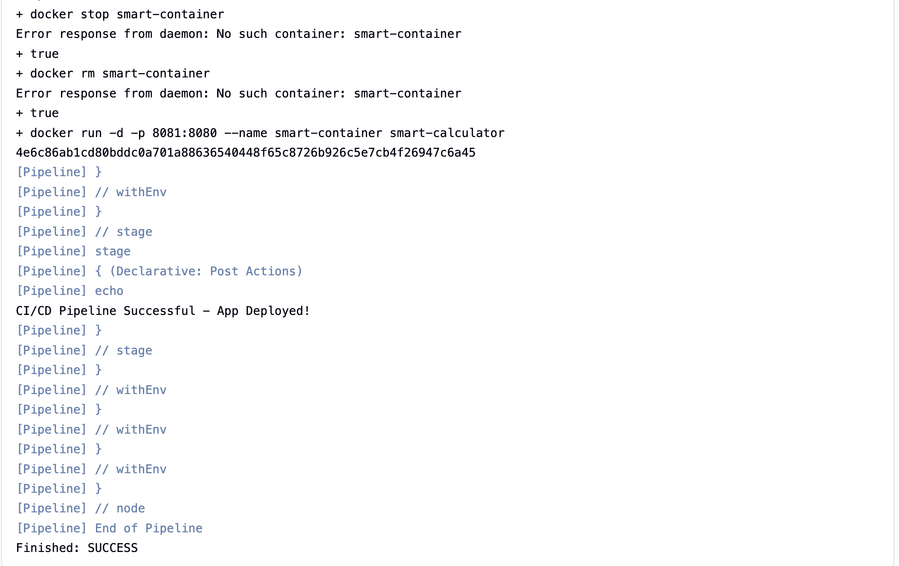
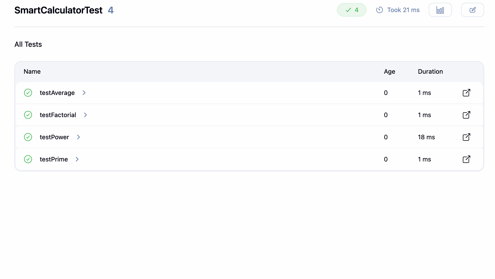
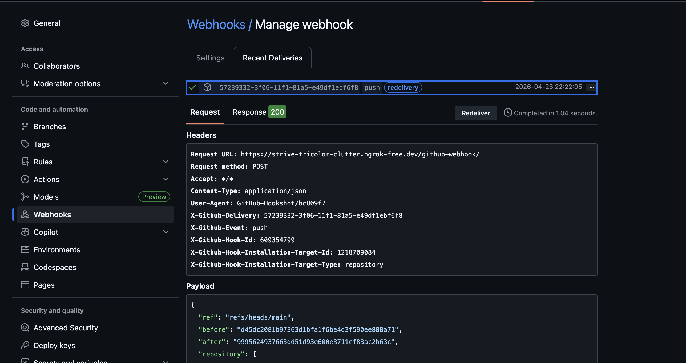

# 🚀 Jenkins CI/CD Pipeline with Docker & ngrok

## 📌 Project Overview

This project demonstrates a complete **CI/CD pipeline** using Jenkins, Maven, Docker, and GitHub Webhooks.
Whenever code is pushed to GitHub, Jenkins automatically:

* Builds the project
* Runs test cases
* Packages the application
* Builds a Docker image
* Deploys the application in a container

---

## 🛠️ Tech Stack

* ☕ Java (JDK 21)
* 📦 Maven
* ⚙️ Jenkins
* 🐳 Docker
* 🔗 GitHub Webhooks
* 🌐 ngrok

---

## ⚙️ CI/CD Workflow

```
Git Push → GitHub Webhook → ngrok → Jenkins → Maven Build → Docker Build → Deploy Container
```

---

## 📁 Project Structure

```
.
├── src/
├── pom.xml
├── Dockerfile
├── Jenkinsfile
└── README.md
```

---

## 🔧 Setup Instructions

### 1️⃣ Install Required Tools

* Java (JDK 21)
* Maven
* Docker
* Jenkins

---

### 2️⃣ Start Jenkins

Access Jenkins UI:

```
http://<your-vm-ip>:8080
```

---

### 3️⃣ Configure Jenkins

### 🔹 Install Plugins

* Git Plugin
* GitHub Integration Plugin
* Docker Pipeline Plugin

### 🔹 Configure Tools

* JDK → jdk21
* Maven → maven

---

## 🌐 ngrok Setup (Important)

Expose Jenkins to GitHub using ngrok.

### ▶️ Start ngrok

```bash
ngrok http 8080
```

### Example URL:

```
https://abcd1234.ngrok-free.dev
```

---

## 🔗 GitHub Webhook Setup

Go to:

```
Repository → Settings → Webhooks → Add Webhook
```

### Configure:

Payload URL:

```
https://<ngrok-url>/github-webhook/
```

Content Type:

```
application/json
```

---

## 🐳 Docker Setup

### Build Image:

```bash
docker build -t smart-calculator .
```

### Run Container:

```bash
docker run -d -p 8081:8080 --name smart-container smart-calculator
```

---

## 🧪 Pipeline Stages

1. Checkout Code
2. Build (Maven)
3. Run Tests
4. Publish Test Results
5. Package
6. Build Docker Image
7. Deploy Application

---

## ▶️ Trigger Pipeline

### Automatic Trigger:

```bash
git add .
git commit -m "update"
git push
```

### Manual Trigger:

Click **Build Now** in Jenkins

---

## 🔍 Verify Deployment

Check container:

```bash
docker ps
```

Test app:

```bash
curl http://<vm-ip>:8081
```

---

## 📸 Project Screenshots

### 🚀 CI/CD Pipeline Success


---

### 🧪 Test Execution



### 🔗 GitHub Webhook (200 OK)



---
## ❗ Common Issues & Fixes

### 🔴 Webhook not working

* Ensure ngrok is running
* Check correct webhook URL

---

### 🔴 JAVA_HOME issue

* Configure correct JDK path in Jenkins

---

### 🔴 Docker permission issue

```bash
sudo usermod -aG docker jenkins
sudo systemctl restart jenkins
```

---

## 📈 Future Enhancements

* Push Docker image to Docker Hub
* Deploy to Kubernetes
* Add SonarQube for code quality
* Use AWS EC2 instead of ngrok

---

## 👨‍💻 Author

**Shubham Navale**

---

## ⭐ Conclusion

This project demonstrates a real-world CI/CD pipeline with automated build, test, and deployment using Jenkins and Docker.
